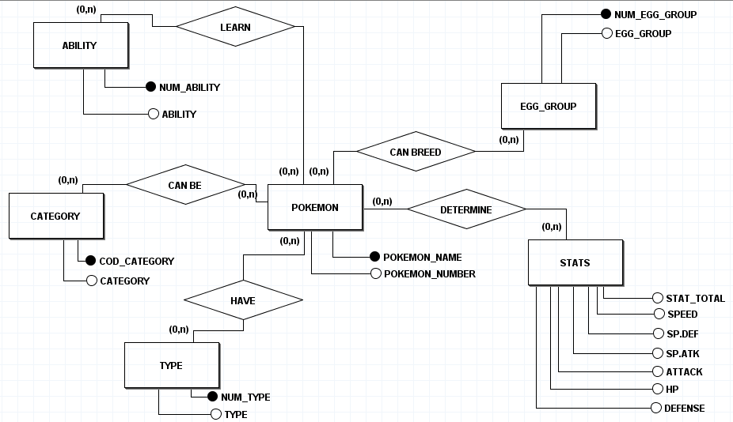

# Pokemon(PyPanda) 

### Organização do Banco de Dados:

 Para a organização do banco de dados, foi criado um esquema de banco relacional. Dessa forma, os dados retirados do dataset podem ser distribuídos e retirados para análise com maior praticidade.

 

 Após a esquematização do banco relacional. Foi utilizado o PySpark para a criação do Banco de Dados e suas tabelas.

 ##### Clique [aqui](../cod_programacao/programacao_pokemon_pyspark.ipynb) para ver o código da programação. 🖥️

 ### Tratamento do Banco de Dados:

 Para a retirada de linhas repetidas e com o valor nulo, as informações sobre cada Pokémon foram listadas em tabelas únicas e listada com seu respectivo Pokemon de acordo com cada relacionamento e ID.

 ### Finalização do Tratamento de dados:

 Em geral, o tratamento dos dados possibilitou a manipulação do dataset bruto para um banco de dados com maior organização de informações.
 No início, com o dataset bruto, tinha-se uma tabela com 22 campos. Na conclusão do projeto, foi possível adicionar 16 novas tabelas sem repetição de dados.

##### Clique [aqui](tabelas_pokemon_pyspark.md) para encontrar as prints de todas as tabelas.

 ### Análise (Utilização PySpark):

A utilização do PySpark para a manipulação e criação do banco de dados, de modo geral, foi prática e sem maiores problemáticas. Entretanto, como estudante do conteúdo de PySpark deve ser enfatizado que, caso existam funções desconhecidas para seus objetivos, não há facilidade para encontrar conteúdos e exemplos sobre sua programação em comparação com o Pandas. Logo, em questão de proximidade ao aprendizado, o Pandas possui maior diversidade de informações evidentes. Porém, relativo ao uso do pyspark.sql, torna-se mais eficaz, já que a linguagem SQL é mais simples de se aplicar.
