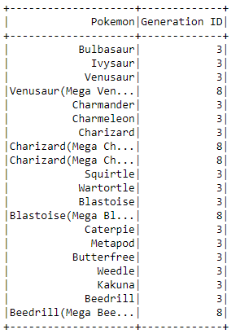

# Tabelas Desenvolvidas no PySpark (Pokemon)

##### Pokemon e Número na Pokedex:

##### Pokemons Mega:

##### Pokemons e Status:

##### Pokemons e Geração:

##### Pokemons e Especies:

##### Pokemons e Tipos:

##### Pokemons e Habilidades:

##### Pokemons e Categorias:

##### Pokemons e Breeding:

##### Especies:

##### Habilidades:

##### Tipos:

##### Gerações:

##### Categorias:

##### Breeding:
